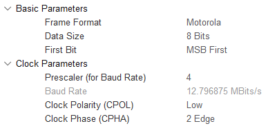
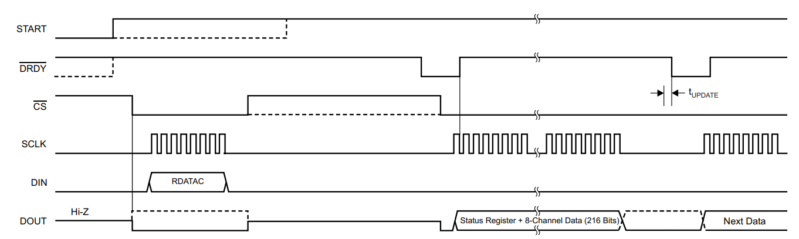

# Бібліотека цифрового електроенцифалографічного фронт-енду ADS129x

В репозиторії наведено просту бібліотеку для створення проектів на базі електроенцифалографічного фронт-енду ADS129x від Texas Instruments. Наведений код має архітектурні особливості: бібліотека була написана для зв'язки STM32 + ADS1299. Для експорту даного проекту на інших мікроконтролери/мікропроцесори - необхідно внести зміни в архітектурозалежні функції бібліотеки. 

## Апаратні вимоги для роботи з ADS129x

### **Тактування цифрового фронт-енду**
##
 Перед початком роботи з шиною даних, необхідно впевнитись в правильній роботі каналу тактування. Це важливо, оскільки дана частота впливає на вихідну частоту дискретизації. Якщо використовувати мікроконтролер як генератор тактової частоти для цільової мікросхеми - варто задуматись над правильним вибором генеруючого джерела для самого мікроконтролера, оскільки завдяки зміні внутрішньої частоти роботи апаратних блоків мікроконтролера можна досягти необхідної частоти виходу таймеру. В реальних кейсах раджу використовувати зовнішній генератор тактового сигналу для даної мікросхеми.  
 Функція запуску генератора наведена в бібліотеці. В даному кейсі було використано таймер в режимі ШІМ з його послідуючим запуском за допомогою функції:

```c 
  void INIT_TIMER (void) {

    HAL_TIM_PWM_Start(&htim1, TIM_CHANNEL_1);                                     // 2.048MHz
 
  }
```
### **Налаштування роботи інтерфейсу SPI**
##
Функція налаштування апаратного блоку SPI не наведена в бібліотеці, оскільки це дуже апраатнозалежний блок, який навіть між мікроконтролерами STM32, однієї серії, не буде давати 100% гарантії роботи. Самі налаштування апаратного блоку наведені нижче.



Пін Chip_Selection, в даному випадку, реалізується програмними засобами. Для експорту бібліотеки необхідно змінити функції, що змінюють логічний стан піна мікроконтролеру. 

```c
#define CS_ADS_SET()       HAL_GPIO_WritePin(GPIOB, GPIO_PIN_12, GPIO_PIN_RESET)

#define CS_ADS_RESET()     HAL_GPIO_WritePin(GPIOB, GPIO_PIN_12, GPIO_PIN_SET)
```

### **Порти керування**
##
Окрім SPI інтерфейсу, мікросхема має апаратні керуючі порти. Їх функціонал доступний не лише завдяки фізичним сигналам, але й через подачу команд за SPI інтерфейсом. Для експорту бібліотеки необхідно змінити функції, що змінюють логічний стан пінів мікроконтролеру. 

```c
#define RESET_ADS_OFF()    HAL_GPIO_WritePin(GPIOB, GPIO_PIN_6, GPIO_PIN_SET)

#define RESET_ADS_ON()     HAL_GPIO_WritePin(GPIOB, GPIO_PIN_6, GPIO_PIN_RESET)

#define PWDN_ADS_OFF()     HAL_GPIO_WritePin(GPIOB, GPIO_PIN_2, GPIO_PIN_SET)

#define PWDN_ADS_ON()      HAL_GPIO_WritePin(GPIOB, GPIO_PIN_2, GPIO_PIN_RESET)

#define START_ADS_SET()    HAL_GPIO_WritePin(GPIOB, GPIO_PIN_11, GPIO_PIN_SET)

#define START_ADS_RESET()  HAL_GPIO_WritePin(GPIOB, GPIO_PIN_11, GPIO_PIN_RESET)
```

## Програмні вимоги для роботи з ADS129x

### **Апаратнозалежні функції**
##

Для правильної роботи бібліотеки на різних платформах - достатньо внести зміни до апаратнозалежних функцій. 

```c
/*                                  Архітектурно-залежні функції                 */

  void    DELAY (uint8_t x);            // Блокуюча! затримка в міліСекундах
  uint8_t TRANSMITTING (uint8_t data);  // Передача одного байту даних по SPI
  void    UPDATE ();                    // Функція ініціювання прийому даних. Запуск за перериванням по Data Ready
/********************************************************************************/

```

### **Передача даних до цільової мікросхеми**
##

Дана операція виконується наведеною нижче функцією:

```c
  uint8_t TRANSMITTING (uint8_t data) {

    uint8_t opcode1 = data;
    uint8_t opcode2 = 0;
    HAL_SPI_TransmitReceive (&hspi2, &opcode1, &opcode2, sizeof(opcode2), 0x100);
    return opcode2;
  }
```
Функція отримує на вході 8-бітне число, надсилає його через SPI інтерфейс та, паралельно транзакції передачі, зчитує пакет даних з мікросхеми. Така операціє є універсальною та допомогає уникнути використання окремих функцій для передачі та прийому даних. Прийом же реалізується відправкою пустого пакету. 

### **Прийом повного кадру даних**
##

В даній бібліотеці реалізований алгоритм прийому даних в режимі **Read Data Continuous**. Це означає, що мікросхема буде генерувати переривання та відразу надсилати дані по SPI. Для цього необхідно надіслати команду **RDATAC** в функції початкової ініціалізації. А далі - послідовно приймати 27 байт даних за кожним перериванням мікросхеми. 



Для реалізації роботи даного алгоритму, необхідно налаштувати апаратне переривання за сигналом DRDY з активним низьким фронтом сигналу. В функції-обробнику переривання необідно запустити функцію оновлення буферу даних:

```c
  void UPDATE (void){

    CS_ADS_SET();
    
    for(int i=0; i<27; i++){
      output[i] = 0;
    }

    HAL_SPI_Receive_DMA (&hspi2, output, 27);
  }
```

Для роботи даної функції вам необхідно лише змінити внутрішню функцію, яка запускає прийом даних за допомогою DMA блоку. Після кожного переривання необхіжно отримати 27 байт данних. Буфер даних, краще, залишити глобальним. 

### **Блокуюча затримка**
##

Дана функція необхідна лише для правильної початкової ініціалізації цільової мікросхеми. В подальшій роботі блокуючі затримки не є необхідними. 

```c
  void DELAY(uint8_t x) {

    HAL_Delay(x);
  } 
```

Для роботи даної функції необхідно змінити внутрішню функцію, яка реалізує програмну блокуючу затримку в мілісекундах.  


